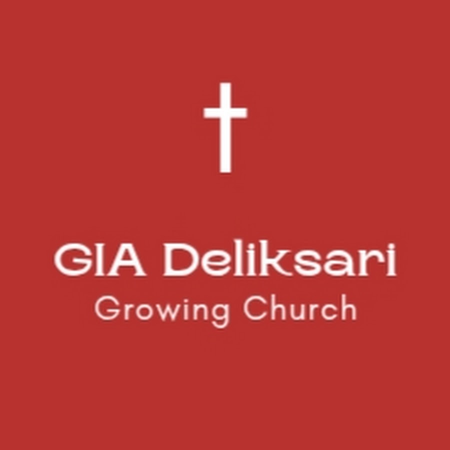
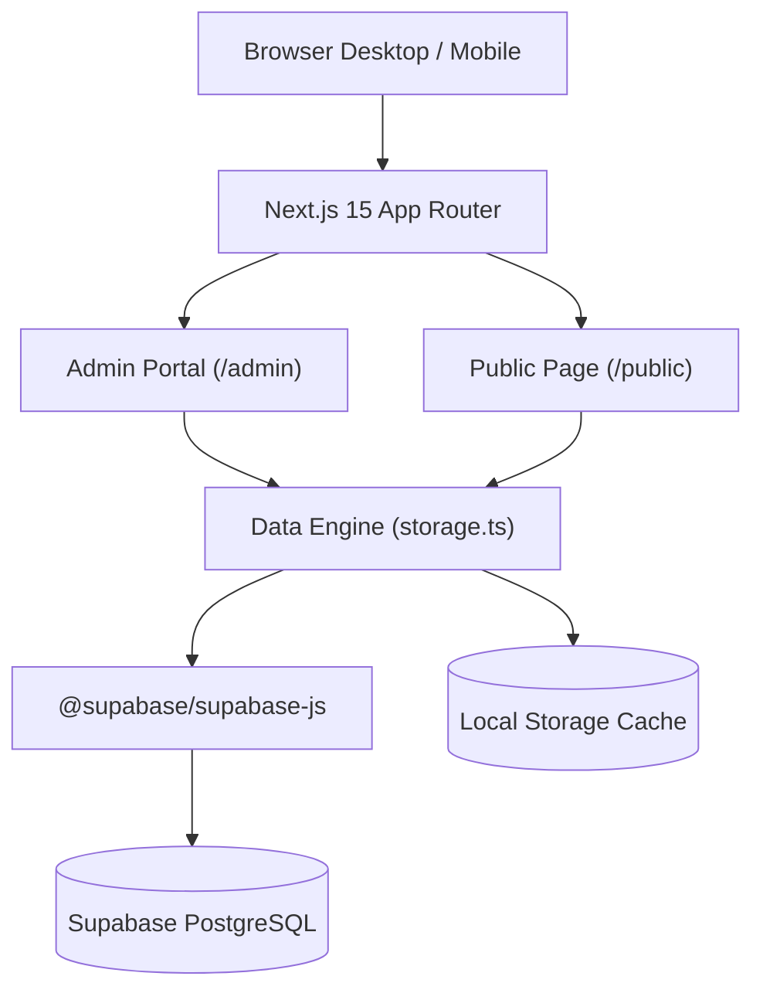

<div align="center">

  

  # GIA DELIKSARI SEMARANG
  ### Portal Publik Jemaat & Sistem Informasi Operasional Gereja
  
  [](https://nextjs.org/)
  [](https://react.dev/)
  [](https://www.typescriptlang.org/)
  [](https://tailwindcss.com/)
  [](https://supabase.com/)
  [](LICENSE)

  <p align="center">
    <strong>Gereja Isa Almasih Deliksari</strong> — <em>"A Growing Church in Faith, Love, and Hope"</em><br />
    Jl. Kolonel Hadijanto, Deliksari, Gunung Pati, Kota Semarang, Jawa Tengah 50229
  </p>

</div>

---

## 🌐 Tautan Halaman & Akses Aplikasi (Live Routes)

Aplikasi web ini terbagi menjadi dua gerbang akses utama:

| Gerbang Akses | Tautan Halaman | Deskripsi & Autentikasi |
|---|---|---|
| 🕊️ **Public Landing Page** | [`/public`](/public) atau [`/`](/) | Akses publik terbuka untuk jemaat & pengunjung: profil gereja, visi gembala, warta jemaat, 4 pilar ibadah, galeri foto asli, jadwal, dan kontak. |
| 🛡️ **Admin Management Portal** | [`/admin`](/admin) | Akses internal pengurus gereja untuk input warta, plotting jadwal pelayan ibadah, dan checklist inventaris. **Default Password:** `9900` |

---

## 📖 Ringkasan Proyek

**GIA Deliksari Web** adalah platform digital komprehensif yang dibangun khusus untuk melayani jemaat **Gereja Isa Almasih (GIA) Deliksari Semarang**. Platform ini menggabungkan landing page publik yang modern, responsif, dan interaktif dengan portal manajemen operasional gereja yang terintegrasi langsung ke cloud database **Supabase**.

### 🌟 Fitur Utama

### 1. Public Landing Page (`/public` & `/`)
- **Hero & Church Identity**: Banner foto riil gedung gereja, tagar *"GROWING CHURCH! 🔥"*, serta akses cepat ke warta dan jadwal.
- **Tentang & Gembala Sidang**: Profil pelayanan **Ps. Yohanes Sutono** beserta visi, misi, dan nilai-nilai inti jemaat.
- **4 Pilar Pelayanan Ibadah**:
  1. ⛪ **Ibadah Raya Umum** (Minggu 07:00 & 16:30 WIB)
  2. 🔥 **Grow Generation Youth / PRBK** (Sabtu 17:00 WIB)
  3. 🎨 **COC Kidz / Sekolah Minggu** (Minggu 07:00 WIB)
  4. 🌸 **Persekutuan Kaum Wanita Hana** (Kamis 16:00 WIB)
- **Papan Warta & Pengumuman Interaktif**: Menampilkan pengumuman minggu depan/bulan ini yang terfilter langsung dari database.
- **Galeri Dokumentasi Foto Asli**: 8+ foto resolusi tinggi terverifikasi dari Google Maps dan YouTube dengan filter kategori dan tampilan *interactive lightbox modal*.
- **Lokasi & Google Maps**: Integrasi lokasi resmi, panduan rute navigasi, dan tautan deep link WhatsApp doa/konseling.
- **Dark Mode & Light Mode**: Dukungan pergantian tema dinamis (*persisted*).

### 2. Admin Operational Portal (`/admin`)
- 🔒 **Security Gate**: Terproteksi password session-based (`9900`).
- 📢 **Manajemen Warta & Pengumuman**: Tambah, edit, hapus, pin warta prioritas, dan filter status publikasi.
- 👥 **Plotting Jadwal Pelayan Ibadah**: Tab khusus untuk 4 kategori (General, Youth, Kidz, Hana) dengan input peran (WL, Singer, Pemusik, Multimedia, Usher, dll), nomor telepon, dan status konfirmasi.
- 📦 **Checklist & Audit Inventaris**: Daftar inventaris alat gereja (Sound System, Multimedia, Musik, Kursi & Gedung) dengan fitur centang/uncentang realtime, filter status kondisi (*Good / Maintenance / Broken*), dan reset checklist sebelum ibadah.
- 🔄 **Supabase Dual-Sync Engine**: Otomatis menyimpan data ke cloud database Supabase PostgreSQL sekaligus caching lokal di `localStorage` saat offline.

---

## 🛠️ Tech Stack & Arsitektur



- **Framework**: Next.js 15.5 (App Router, Server Components & Static Site Generation)
- **UI & Styling**: React 19, Tailwind CSS 3 (Custom Warm Amber & Navy Palette, Dark/Light mode)
- **Database**: Supabase PostgreSQL dengan skema tabel relasional dan RLS
- **Icons & Assets**: Lucide React Icons & Custom Church Brand SVG Icons
- **Optimization**: `next/image` modern AVIF/WebP image pipeline

---

## 📁 Struktur Direktori

```text
gia-deliksari-web/
├── public/
│   ├── images/                 # Aset foto asli resolusi tinggi & logo gereja
│   │   ├── logo.png            # Logo resmi GIA Deliksari
│   │   ├── hero-church.jpg     # Foto tampak depan gedung fisik gereja
│   │   ├── pastor-yohanes.jpg  # Ps. Yohanes Sutono di mimbar
│   │   ├── ministry-*.jpg      # Foto dokumentasi 4 pilar pelayanan
│   │   └── gallery-*.jpg       # Galeri foto kegiatan & persekutuan
├── src/
│   ├── app/
│   │   ├── layout.tsx          # Root layout & tema
│   │   ├── page.tsx            # Halaman beranda utama
│   │   ├── public/page.tsx     # Route alias publik (/public)
│   │   └── admin/page.tsx      # Portal admin operasional & autentikasi
│   ├── components/
│   │   ├── Navbar.tsx          # Navigasi sticky responsif + logo resmi
│   │   ├── HeroSection.tsx     # Hero banner utama
│   │   ├── AboutSection.tsx    # Profil gereja & gembala
│   │   ├── MinistrySection.tsx # 4 pilar pelayanan
│   │   ├── AnnouncementsSection.tsx # Papan pengumuman jemaat
│   │   ├── ScheduleSection.tsx # Jadwal ibadah mingguan
│   │   ├── GallerySection.tsx  # Galeri foto asli + modal lightbox
│   │   ├── ContactSection.tsx  # Lokasi, peta, kontak, & medsos
│   │   ├── Footer.tsx          # Footer & copyright
│   │   ├── ThemeToggle.tsx     # Toggle Dark/Light mode
│   │   └── Icons.tsx           # Ikon brand Instagram & YouTube
│   ├── lib/
│   │   ├── supabase.ts         # Inisialisasi Supabase Client
│   │   └── storage.ts          # Lapisan penyimpanan & sinkronisasi data
│   └── types/
│       └── index.ts            # TypeScript interfaces
├── supabase/
│   └── schema.sql              # Skema database & tabel Supabase
├── scripts/
│   ├── download-all-real-photos.js # Script scraper & downloader foto asli
│   ├── download-logo.js            # Script pengunduh logo resmi gereja
│   ├── migrate.js                  # Script migrasi skema database
│   └── seed-supabase.js            # Script seeding data awal
├── PRD.md                      # Product Requirements Document
├── DESIGN.md                   # Semantic Design System Guidelines
├── LICENSE                     # Lisensi Proprietary & Private
└── package.json
```

---

## 🗄️ Skema Database Supabase

Proyek ini menggunakan 3 tabel utama di Supabase PostgreSQL:

1. **`announcements`**: Menyimpan warta jemaat, tanggal acara, pin priority, dan status publikasi.
2. **`servant_rosters`**: Menyimpan plotting jadwal pelayan ibadah untuk 4 kategori (`general`, `youth`, `kidz`, `hana`), peran, nama pelayan, dan nomor telepon.
3. **`inventory_items`**: Menyimpan daftar barang operasional gereja, kategori, kode inventaris, jumlah, status centang checklist, dan kondisi fisik.

---

## 🚀 Panduan Menjalankan Proyek Secara Lokal

### 1. Clone Repository & Masuk Direktori
```bash
git clone https://github.com/zzdree/gia-deliksari-web.git
cd gia-deliksari-web
```

### 2. Install Dependensi
```bash
npm install
```

### 3. Konfigurasi Environment Variables
Buat file `.env.local` di root proyek:
```env
NEXT_PUBLIC_SUPABASE_URL=https://<your-project-ref>.supabase.co
NEXT_PUBLIC_SUPABASE_ANON_KEY=<your-anon-key>
SUPABASE_ACCESS_TOKEN=<your-access-token>
NEXT_PUBLIC_ADMIN_PASSWORD=9900
```

### 4. Jalankan Development Server
```bash
npm run dev
```
Buka browser di [http://localhost:3000](http://localhost:3000).

### 5. Build untuk Produksi
```bash
npm run build
npm run start
```

---

## 📱 Media Sosial & Kontak Resmi Gereja

- 📷 **Instagram**: [@giadeliksari](https://www.instagram.com/giadeliksari/)
- 🔥 **Youth Instagram**: [@growgeneration_](https://www.instagram.com/growgeneration_/)
- 🎈 **Kids Instagram**: [@cockidz](https://www.instagram.com/cockidz/)
- 🎥 **YouTube Channel**: [@GIADeliksariSemarang](https://www.youtube.com/@GIADeliksariSemarang)
- 📍 **Google Maps**: [Gereja Isa Almasih Deliksari Semarang](https://share.google/O7HqL1J615kgxt66v)

---

## 🔒 Lisensi

Kode sumber dan seluruh aset dalam proyek ini bersifat **Proprietary & Private (All Rights Reserved)**. Hak Cipta dilindungi undang-undang atas nama **Gereja Isa Almasih Deliksari Semarang**. Detail ketentuan tertera pada file [LICENSE](LICENSE).
